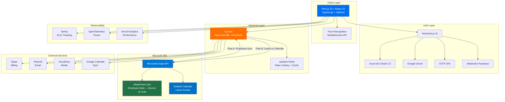

<div align="center">

# 🏢 Strata Platform

[](https://github.com/roma-frontend/hr-project/actions)
[](https://github.com/roma-frontend/hr-project/actions)
[](https://github.com/roma-frontend/hr-project/actions)
[](https://codecov.io/gh/roma-frontend/hr-project)

<!-- After setup, replace YOUR_CODECOV_TOKEN with the public badge token from codecov.io Settings → Badge token -->

> ⚡ The second badge updates automatically after each `main` merge.
> Enable **GitHub Pages** (Source: GitHub Actions) in repo settings to activate it.
> []()
> []()
> []()
> []()
> [-000000?logo=vercel&logoColor=white>)](https://hr-project-sigma.vercel.app)

**All-in-One HR Management SaaS Platform**

[Live Demo](https://hr-project-sigma.vercel.app) · [Report Bug](https://github.com/roma-frontend/hr-project/issues) · [Request Feature](https://github.com/roma-frontend/hr-project/issues)

</div>

---

## 📋 Table of Contents

- [About](#-about)
- [Features](#-features)
- [Tech Stack](#-tech-stack)
- [Architecture](#-architecture)
- [Getting Started](#-getting-started)
- [Environment Variables](#-environment-variables)
- [Project Structure](#-project-structure)
- [Testing](#-testing)
- [Deployment](#-deployment)
- [Security](#-security)
- [Internationalization](#-internationalization)
- [API Reference](#-api-reference)
- [Contributing](#-contributing)
- [Roadmap](#-roadmap)
- [License](#-license)

---

## 🎯 About

**Strata** is a comprehensive, enterprise-grade HR management platform that centralizes all HR operations into a single, real-time application. Built for organizations that need modern workforce management — from employee lifecycle and attendance tracking (with face recognition) to AI-powered analytics and Microsoft 365 integration.

### The Problem

HR processes are typically fragmented across multiple disconnected tools:

- Employee data scattered in spreadsheets and SharePoint lists
- Leave requests handled via email with no calendar visibility
- Attendance tracked manually — error-prone and time-consuming
- No centralized task management or real-time analytics

### The Solution

Strata replaces all fragmented tools with a **unified platform** — zero manual data entry, single source of truth synced from SharePoint, and automated Outlook Calendar integration for approved leaves.

### Scale (verified 2026-09-15)

|                         |                                                                 |
| ----------------------- | --------------------------------------------------------------- |
| Product modules shipped | **46** (Employees → Payroll → Compliance → Workflow automation) |
| Dashboard pages         | 114 across 48 module folders                                    |
| API route handlers      | 91                                                              |
| UI components           | 504                                                             |
| Convex backend modules  | ~90 files, 66 schema files, ~106k LOC                           |
| Test files              | 652 (Jest + React Testing Library + Playwright)                 |
| Languages               | EN / RU / HY / DE                                               |
| Type safety             | `npm run type-check` clean                                      |

---

## ✨ Features

| Module                              | Description                             | Highlights                                                                                                        |
| ----------------------------------- | --------------------------------------- | ----------------------------------------------------------------------------------------------------------------- |
| 👤 **Employee Lifecycle**           | Full employee profile management        | Documents, performance metrics, onboarding/offboarding                                                            |
| 🔐 **Face Recognition**             | Biometric attendance check-in/out       | Browser-based camera, daily logs, anomaly detection                                                               |
| 📅 **Leave Management**             | End-to-end leave workflow               | Multi-level approval, auto Outlook Calendar sync, entitlement rules                                               |
| 📋 **Task Management**              | Kanban board with drag-and-drop         | Assignment, deadlines, progress tracking, notifications                                                           |
| 💬 **Team Chat**                    | Real-time messaging                     | File sharing, channels, direct messages                                                                           |
| 🤖 **AI HR Assistant**              | Conversational HR chatbot               | Policy Q&A, smart insights, analytics queries                                                                     |
| 🚗 **Driver Management**            | Vehicle/driver booking system           | Availability tracking, scheduling, route management                                                               |
| 📊 **AI Analytics**                 | Workforce intelligence dashboard        | Headcount trends, leave patterns, attendance heatmaps                                                             |
| 🔗 **M365 Integration**             | SharePoint + Outlook sync               | Auto employee sync, calendar events for leave                                                                     |
| 🆔 **imID Integration**             | Armenian digital identity & e-signature | OAuth login, document signing, employee verification via imID                                                     |
| 🇦🇲 **Armenia Local-Ready**          | Tax & payments layer no global HR has   | SRC-ready payroll export (ՀՎՀՀ, stamp duty, pension), Idram/ArCa billing, Armsoft sync, SRC taxpayer verification |
| 🗓 **Shift Scheduling**             | Weekly roster planner                   | Shift templates, swap requests with notifications, plan-gated module                                              |
| 💳 **Multi-Tenant Billing**         | Stripe + local PSP subscription mgmt    | Plans, invoicing, usage tracking, Idram/ArCa (Armenia) support                                                    |
| 📈 **Performance & OKR**            | 360° reviews and goal management        | Cycles, templates, competency snapshots, peer anonymity, OKR trees, check-ins                                     |
| 🎓 **Learning (LMS)**               | Course catalog + compliance training    | Lessons, quizzes, certificates, team overview                                                                     |
| 🧲 **Recruitment / ATS**            | End-to-end hiring pipeline              | Kanban stages, interviews, scorecards, public careers page, email templates                                       |
| 🚀 **Onboarding / Offboarding**     | Lifecycle workflows                     | Checklists, buddy/mentor, exit interviews, retention analytics, cron reminders                                    |
| ✍️ **E-Signatures**                 | Native e-signing                        | Canvas signing pad, sequential signing order, immutable snapshot, audit trail, PDF export                         |
| 📣 **Surveys & Recognition**        | Engagement and culture                  | eNPS, pulse surveys, department segmentation, kudos feed, points economy, badges, rewards                         |
| 💰 **Payroll & Compensation**       | Armenian tax rules built in             | Payroll runs, SRC filing sheet, salary bands, review cycles, bonuses                                              |
| 🧾 **Expenses / Benefits / Assets** | Finance operations                      | Expense policies + approval limits, benefit wallets + claims, asset assignments + maintenance                     |
| 🗂 **Document Management**          | Central document library                | Folders, versioning, access control, full-text search, document builder                                           |
| 🕸 **Org Chart & Reporting Line**   | Authoritative hierarchy                 | Interactive tree built from the reporting line, head-of-org, drag-and-drop reorg, SVG export                      |
| 📰 **News & Announcements**         | Company feed                            | Composer, reactions, comments, scheduled posts                                                                    |
| 🎥 **Meetings & Video**             | LiveKit conferencing                    | Video rooms, recording, meeting-room booking                                                                      |
| 🛡 **Security & Compliance**        | Enterprise controls                     | SSO (SAML 2.0 + OIDC), SCIM 2.0, TOTP, passkeys, audit trail, GDPR tools, reason-tracked impersonation            |
| ⚙️ **Workflow Automation**          | Trigger → condition → action            | Visual drag-and-drop builder (operator console today)                                                             |
| ⚡ **Platform Foundations**         | Multi-tenant SaaS base                  | Tariff constructor with versioned plans, server-side entitlements, backups, webhooks, Telegram                    |

### Role-Based Access Control (5 Roles)

| Role           | Permissions                                        |
| -------------- | -------------------------------------------------- |
| **Superadmin** | Full system access, tenant management, billing     |
| **Admin**      | Organization settings, user management, approvals  |
| **Supervisor** | Team management, leave/task approvals, reports     |
| **Employee**   | Self-service: profile, leave requests, tasks, chat |
| **Driver**     | Booking management, availability, schedule view    |

---

## 🛠 Tech Stack

### Frontend

| Technology                                        | Purpose                       |
| ------------------------------------------------- | ----------------------------- |
| [Next.js 16](https://nextjs.org/)                 | React framework (SSR/SSG/ISR) |
| [React 19](https://react.dev/)                    | UI library                    |
| [TypeScript 5.x](https://www.typescriptlang.org/) | Type safety                   |
| [Tailwind CSS](https://tailwindcss.com/)          | Utility-first styling         |
| [Shadcn/ui](https://ui.shadcn.com/)               | Accessible component library  |

### Backend & Database

| Technology                            | Purpose                                   |
| ------------------------------------- | ----------------------------------------- |
| [Convex](https://www.convex.dev/)     | Real-time database + serverless functions |
| [NextAuth.js v5](https://authjs.dev/) | Authentication framework                  |
| [Upstash Redis](https://upstash.com/) | Rate limiting & caching                   |

### Integrations

| Service                                                                   | Purpose                                              |
| ------------------------------------------------------------------------- | ---------------------------------------------------- |
| [Microsoft Graph API](https://learn.microsoft.com/en-us/graph/)           | SharePoint sync + Outlook Calendar                   |
| [Google Calendar API](https://developers.google.com/calendar)             | Calendar sync (alternative)                          |
| [Stripe](https://stripe.com/)                                             | Subscription billing                                 |
| [Resend](https://resend.com/)                                             | Transactional email                                  |
| [imID](https://imid.am)                                                   | Armenian digital identity, OAuth login & e-signature |
| [Lucky Carrot](https://luckycarrotapp.com/integrations)                   | Employee recognition & rewards                       |
| [Cloudinary](https://cloudinary.com/)                                     | Media storage & optimization                         |
| [Sentry](https://sentry.io/) + [OpenTelemetry](https://opentelemetry.io/) | Error tracking & observability                       |

### DevOps

| Tool                                                             | Purpose                    |
| ---------------------------------------------------------------- | -------------------------- |
| [Vercel](https://vercel.com/) (EU, fra1)                         | Hosting & Edge Functions   |
| [GitHub Actions](https://github.com/features/actions)            | CI/CD pipeline             |
| [Playwright](https://playwright.dev/)                            | E2E testing                |
| [Jest](https://jestjs.io/) + [RTL](https://testing-library.com/) | Unit & integration testing |

---

## 🏗 Architecture



### Data Flows

```
Flow A (Employee Sync):
SharePoint List → Microsoft Graph API → Convex DB → Strata UI

Flow B (Leave Calendar Sync):
Strata (Leave Approved) → Convex Action → Microsoft Graph API → Outlook Calendar Event
```

---

## 🚀 Getting Started

### Prerequisites

- **Node.js** 20+ (LTS recommended)
- **npm** 10+ or **pnpm** 9+
- **Convex account** — [sign up free](https://dashboard.convex.dev)
- **Vercel account** — [sign up free](https://vercel.com/signup)

### Installation

```bash
git clone https://github.com/roma-frontend/hr-project.git
cd hr-project
npm install
npx convex dev
cp .env.example .env.local
npm run dev
```

### Quick Commands

```bash
npm run dev          # Start development server + Convex sync
npm run build        # Production build
npm run start        # Start production server
npm run lint         # ESLint check
npm run type-check   # TypeScript type check
npm run test         # Run unit tests
npm run test:e2e     # Run Playwright E2E tests
npm run test:coverage # Run tests with coverage report
```

---

## 🔑 Environment Variables

Create `.env.local` from `.env.example`:

```bash
# CONVEX
CONVEX_DEPLOYMENT=
NEXT_PUBLIC_CONVEX_URL=

# AUTHENTICATION — NextAuth.js v5
NEXTAUTH_SECRET=
NEXTAUTH_URL=http://localhost:3000

# MICROSOFT 365 / AZURE AD (Entra ID)
MICROSOFT_CLIENT_ID=
MICROSOFT_CLIENT_SECRET=
MICROSOFT_TENANT_ID=
SHAREPOINT_SITE_ID=
SHAREPOINT_LIST_ID=

# GOOGLE OAUTH
GOOGLE_CLIENT_ID=
GOOGLE_CLIENT_SECRET=

# STRIPE (Billing)
STRIPE_SECRET_KEY=
STRIPE_PUBLISHABLE_KEY=
STRIPE_WEBHOOK_SECRET=

# RESEND (Email)
RESEND_API_KEY=

# CLOUDINARY (Media Storage)
CLOUDINARY_CLOUD_NAME=
CLOUDINARY_API_KEY=
CLOUDINARY_API_SECRET=

# UPSTASH REDIS (Rate Limiting & Cache)
UPSTASH_REDIS_REST_URL=
UPSTASH_REDIS_REST_TOKEN=

# SENTRY (Error Monitoring)
SENTRY_DSN=
SENTRY_AUTH_TOKEN=

# FEATURE FLAGS
NEXT_PUBLIC_ENABLE_FACE_RECOGNITION=true
NEXT_PUBLIC_ENABLE_AI_ASSISTANT=true
NEXT_PUBLIC_ENABLE_DRIVER_MODULE=true
```

---

## 📁 Project Structure

```
hr-project/
├── .github/workflows/ci.yml
├── convex/                  — real-time DB + serverless backend
│   ├── schema/              — 66 schema files (one per module)
│   ├── billing/             — tariff catalog, plans, entitlements, seed
│   ├── lib/                 — rbac, capabilities, entitlements, tax rules
│   └── *.ts                 — one backend module per product area
├── src/
│   ├── app/
│   │   ├── (auth)/
│   │   ├── (dashboard)/     — 114 pages across 48 module folders
│   │   │   ├── employees/  attendance/  leaves/  tasks/  payroll/ …
│   │   │   ├── performance/ goals/  learning/  recruitment/  surveys/ …
│   │   │   ├── benefits/  expenses/  assets/  documents/  signatures/ …
│   │   │   └── settings/  reports/  compliance/  audit/  superadmin/
│   │   └── api/             — 91 route handlers
│   ├── components/          — 504 components
│   ├── i18n/                — i18next bootstrap
│   ├── lib/                 — payroll rules, exports, PDF, plan gating
│   └── __tests__/           — Jest + RTL suites
├── public/
│   ├── locales/{en,ru,hy,de}/ — 19 namespaces per language
│   ├── manifest.json  sw.js  offline.html — PWA assets
│   └── models/              — face-recognition model weights
├── docs/                    — SOC 2 readiness, SSO/SAML, imID, permissions design
├── e2e/                     — Playwright specs (cross-browser)
└── scripts/                 — CI, coverage ratchet, billing & i18n checks
```

---

## 🧪 Testing

Coverage thresholds are enforced in CI (`jest.config.js`) and ratcheted up
as coverage improves. Coverage reports and badges are published to GitHub
Pages on every merge to `main`.

| Metric         | Enforced gate | Last full local run | Target |
| -------------- | ------------- | ------------------- | ------ |
| **Lines**      | ≥ 68%         | 67.9%               | ≥ 80%  |
| **Branches**   | ≥ 58%         | 57.6%               | ≥ 75%  |
| **Functions**  | ≥ 59%         | 59.8%               | ≥ 80%  |
| **Statements** | ≥ 67%         | 66.5%               | ≥ 80%  |

> Gates live in `jest.config.js` (`coverageThreshold.global`). The published badge JSON is
> `badges/coverage.json`; run `npm run test:coverage` to refresh `coverage/coverage-summary.json`.

> ⚡ Thresholds are auto-ratcheted after each `main` merge via
> `scripts/ratchet-coverage.mjs`. Coverage history tracked on
> [Codecov](https://codecov.io/gh/roma-frontend/hr-project).
> Run `node scripts/ratchet-coverage.mjs --apply` to bump them manually.

### Runs on every PR

| Job               | What it checks                                             |
| ----------------- | ---------------------------------------------------------- |
| `lint`            | ESLint + Prettier                                          |
| `type-check`      | TypeScript `--noEmit`                                      |
| `unit-tests`      | Jest + coverage thresholds + JUnit report + Codecov upload |
| `build`           | Next.js production build                                   |
| `e2e-tests`       | Playwright cross-browser E2E (Chrome + Firefox + WebKit)   |
| `security-audit`  | npm audit + Dependency Review                              |
| `codeql`          | GitHub CodeQL SAST                                         |
| `coverage-report` | Posts coverage summary as a PR comment (PRs only)          |
| `coverage-badge`  | Publishes live badge JSON to GitHub Pages (main only)      |

> 💡 Enable **GitHub Pages** in your repo settings (Source: GitHub Actions)
> and the second coverage badge will update automatically after each `main` merge.

### Codecov History

[Codecov](https://about.codecov.io/) tracks coverage over time and posts
coverage summaries on every PR. To activate:

1. Sign in at [codecov.io](https://codecov.io) with your GitHub account
2. Add the `hr-project` repo
3. Copy the **Repository Upload Token** from repo settings → add as `CODECOV_TOKEN` in GitHub Secrets
4. Copy the **Badge token** from Codecov Settings → replace `YOUR_CODECOV_TOKEN` in the badge URL above
5. The `unit-tests` job will upload coverage automatically on every CI run


Existing test suites live in `src/__tests__/` (Jest) and `e2e/` (Playwright).
Add tests alongside features: `src/__tests__/<area>.test.ts` or `e2e/<flow>.spec.ts`.

---

## 🚢 Deployment

Deployed on **Vercel** in **EU (fra1)** for GDPR compliance.

```bash
git push origin main    # Auto-deploy
vercel --prod           # Manual deploy
```

---

## 🔒 Security

| Layer                | Implementation                                |
| -------------------- | --------------------------------------------- |
| **Authentication**   | OAuth 2.0 (Azure AD + Google), NextAuth.js v5 |
| **Multi-Factor**     | TOTP 2FA + WebAuthn Passkeys                  |
| **Biometric**        | Face Recognition (attendance)                 |
| **Password Hashing** | bcrypt (12 rounds)                            |
| **Authorization**    | Convex RLS, 5-tier RBAC                       |
| **Transport**        | HSTS, TLS 1.3                                 |
| **XSS Prevention**   | CSP headers                                   |
| **Rate Limiting**    | Upstash Redis                                 |
| **Monitoring**       | Sentry + OpenTelemetry                        |

---

## 🌐 Internationalization

| Code | Language    | Status      |
| ---- | ----------- | ----------- |
| `en` | 🇬🇧 English  | ✅ Complete |
| `ru` | 🇷🇺 Russian  | ✅ Complete |
| `hy` | 🇦🇲 Armenian | ✅ Complete |
| `de` | 🇩🇪 German   | ✅ Complete |

19 namespaces per language under `public/locales/<lang>/`. The landing bundles only
`common` + `landing` for every language (first-paint SSR, no flash); dashboard namespaces
lazy-load over HTTP so anonymous visitors never download them.

---

## 🤝 Contributing

1. Fork → 2. Branch (`feature/x`) → 3. Commit (Conventional Commits) → 4. Push → 5. PR

---

## 🗺 Roadmap

- [x] Employee lifecycle, Face recognition, Leave management, Tasks, Chat, AI, Drivers, Analytics
- [x] Microsoft 365 integration, Stripe billing, i18n (EN/RU/HY/DE)
- [x] Performance reviews, Payroll, E-signatures, PDF export
- [x] imID — Armenian digital identity (OAuth login, e-signature, employee verification), Lucky Carrot employee sync
- [x] Shift scheduling (weekly roster, templates, swap requests)
- [x] SRC-ready payroll export — Armenian Tax Service filing sheet (income tax, funded pension, military stamp duty, health insurance, ՀՎՀՀ)
- [x] Local payments (Idram / ArCa): checkout handoff, HMAC-signed webhooks, superadmin configuration — alongside Stripe
- [x] Benefits, Expenses, Assets, Company news feed, Compliance dashboard, Audit log
- [x] Projects, Overtime, Strategy maps, Meeting rooms, LiveKit video conferencing
- [x] Enterprise SSO (SAML 2.0 + OIDC), SCIM 2.0 provisioning, Telegram integration
- [x] Visual workflow builder (currently exposed in the operator console only)
- [x] Public API (`/api/v1`) + HMAC-signed customer webhooks, metered per plan (from Pro up)
- [x] SOC 2 evidence automation (`npm run soc2:evidence`) and public comparison pages (`/compare` + 6 head-to-head, ×4 languages)
- [ ] Succession planning, Career development paths
- [ ] Mobile app (React Native; PWA is installable today)

> 📌 **Statuses are verified against the codebase on 2026-09-16.** Many items previously marked as
> "not started" in [`ROADMAP.md`](./ROADMAP.md) were already shipped — see the verification note there.
> Go-to-market material (positioning, pricing rationale, battlecards) lives in
> [`docs/gtm-playbook.md`](./docs/gtm-playbook.md) and [`docs/battlecards.md`](./docs/battlecards.md).

---

## 📄 License

MIT License

---

## 👨‍💻 Author

**Roman Gulanyan** — [@roma-frontend](https://github.com/roma-frontend) — romangulanyan@gmail.com

<div align="center">Built with ❤️ using Next.js + Convex + Microsoft 365</div>
